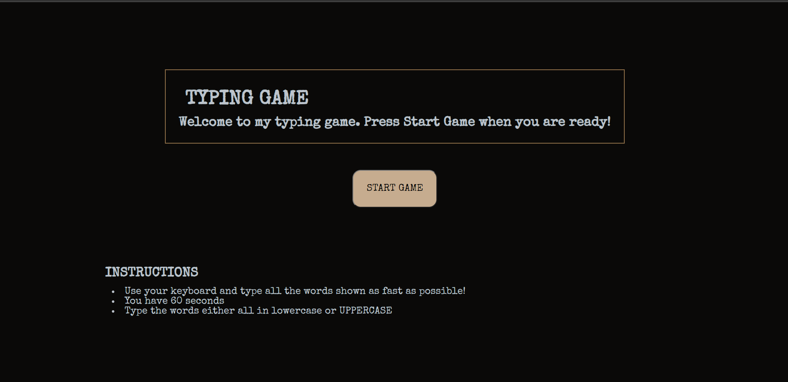
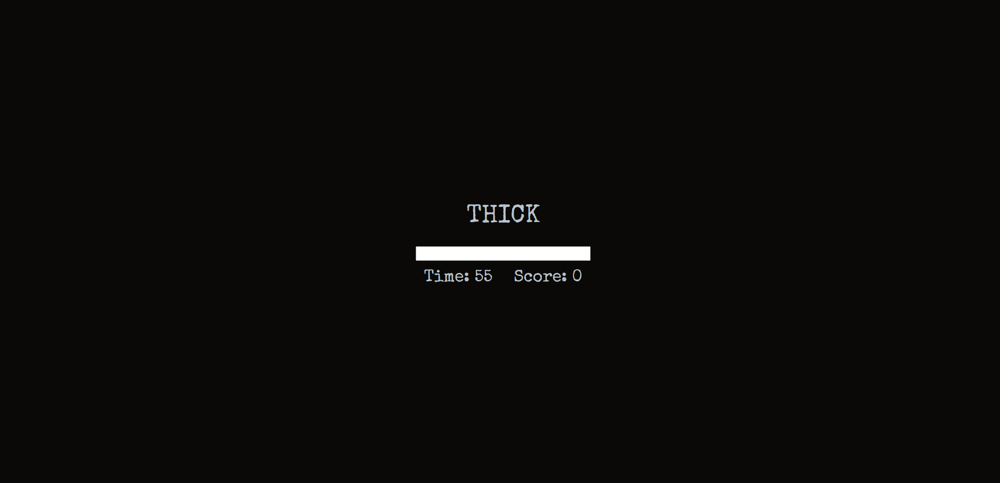
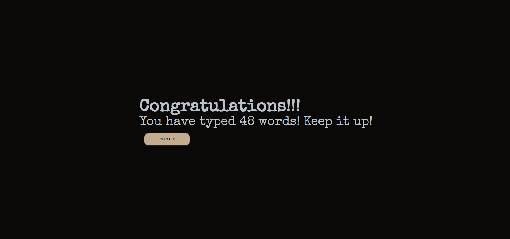

# TYPING GAME

This game was created to test my understanding of Javascript fundamentals, DOM Manipulation, HTML and SASS (SCSS) as well as getting practice with using command line and Github flow.

Link to live site: https://j-jinjia.github.io/typing-game/

# ABOUT

This game was created with:

- UI design: HTML and SASS (SCSS and the compiled to CSS, BEM notation for SASS)
- Functionality: JavaScript

It has a responsive design for :

- Mobile devices up to 768px
- Tablets and small laptops up to 1024px
- PC monitors or larger devices from 1024px

# FUNCTIONALITY

The typing game can be played as follows:

- Read the instructions
- Press the start game button
- Using the keyboard, type the words in the input box shown on screen.
- After completion of the game, press on restart button to play again.

# FEATURES

The features of this game includes:

- Typing words with the keybard.
- Random word display
- Timer
- Score counter
- Restart the game with restart button.

# PREVIEW

Main screen: 

 
In game screen: 

 
Ending screen: 

 
